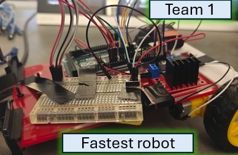
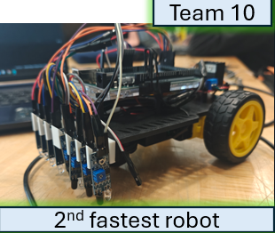
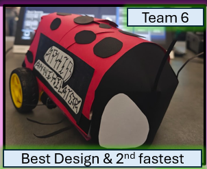
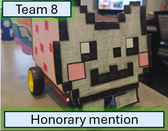
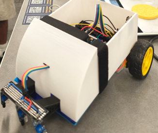
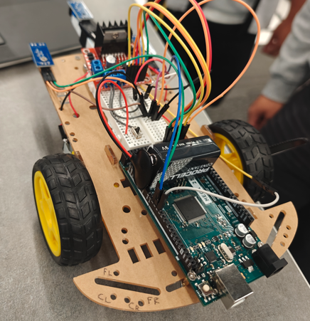

# **EE Bobcats' Robotics Hall of Fame**

<link rel="stylesheet" href="style.css">

  <video id="ee005-teaser-video" muted autoplay playsinline preload="metadata" poster="web-photos/video-poster.png">
    <source src="web-photos/ee005-video.mp4" type="video/mp4">
    Your browser does not support the video tag.
  </video>
  
Final robotics competition teaser.

## EE 005: Designing and Building EE Systems

The teams listed here are recognized for excellence in the final robotics competition for EE 005 at UC Merced.

This Hall of Fame highlights robots that excelled on the basic and advanced track and designs selected by the class for their creativity, engineering, and presentation.

## EE 005: Spring 2026

### Final Robotics Competition

#### Bobcat Speed Challenge

Recognizing the fastest robots on the basic and advanced tracks.

  <section class="winner-card">
    <h4>Fastest Robot</h4>
    <figure class="photo-frame">
      
      <figcaption>The winning robot</figcaption>
    </figure>
    
<strong>Students:</strong> Andres Gonzalez-Guevara, Anthony Klostrakis, Jesus Lopez-Alvarez, Justin Ear

    
The fastest robot design: simple and effective

  </section>
  <section class="winner-card">
    <h4>2nd Fastest Robot</h4>
    <figure class="photo-frame">
      
      <figcaption>The runner up robot</figcaption>
    </figure>
    
<strong>Students:</strong> Alan Jimenez, Isaac Anderson, Itzel Gonzalez Hernan, William Cargill

    
The second fastest robot design: ladybird design

  </section>

#### People's Choice Design

Recognizing the most popular robot designs selected by the class.

  <section class="winner-card">
    <h4>Most Popular Design</h4>
    <figure class="photo-frame">
      
      <figcaption>Most popular design</figcaption>
    </figure>
    
<strong>Students:</strong> Alan Jimenez, Isaac Anderson, Itzel Gonzalez Hernan, William Cargill

    
Most popular design: A ladybird by Team 6

  </section>
  <section class="winner-card">
    <h4>Honorable Mention: Most Popular Design</h4>
    <figure class="photo-frame">
      
      <figcaption>Honorary mention: Most popular design</figcaption>
    </figure>
    
<strong>Students:</strong> Angelica Ventura, Harkanwal Behniwal, Jayden Zhu, and Quenie Mavic Jean Fornoles

    
Most popular design: A minecraft cat by Team 8

  </section>

## EE 005: Spring 2025

### Final Robotics Competition

#### People's Choice Design

Recognizing the most popular robot designs selected by the class.

  <section class="winner-card">
    <h4>Best Design</h4>
    <figure class="photo-frame">
      
      <figcaption>Best design</figcaption>
    </figure>
  </section>
  <section class="winner-card">
    <h4>Honorable Mention: Most Popular Design</h4>
    <figure class="photo-frame">
      
      <figcaption>Honorary mention: Most popular design</figcaption>
    </figure>
  </section>

